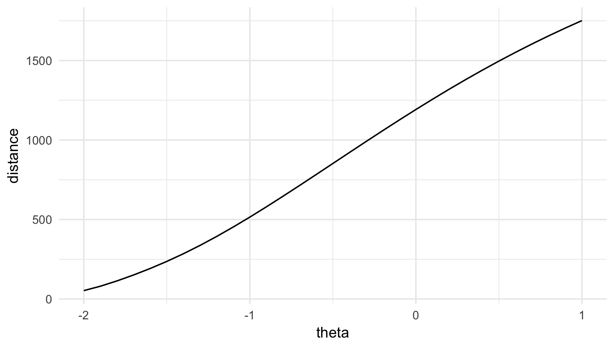

# gravity.distances

The R package `gravity.distances` provides *aggregate* distances between geographic entities — such as countries, US states or Canadian provinces — that are consistent with the gravity equation in international economics. Please check out [julianhinz.com/resources/distances](julianhinz.com/resources/distances) for more information.

## Installation

Install from Github via the [devtools](https://devtools.r-lib.org) package:
```R
devtools::install_github("julianhinz/gravity.distances")
```

## Examples

The `get_distance` function provides distances between two geographic entities for a given point in time for a given value &theta;. The &theta; is a parameter in the aggregation of the mean that yields the harmonic mean for &theta; = -1, the geometric mean for &theta; = 0 and the arithmetic mean for &theta; = 1. In almost all cases in which a general gravity relationship is assumed to hold, i.e. when the underlying data generating process posits a negative relationship of the variable of interest with distance, the harmonic mean should be used.

### Distance between two geographic entities

To get the distance between two countries, simply set the `origin` and `destination` argument to the [ISO 3166-1 alpha-3](https://en.wikipedia.org/wiki/ISO_3166-1_alpha-3) country codes of the two countries. The `year` argument defaults to 2012, the `theta` argument defaults to -1, i.e. the harmonic mean.

```R
library(gravity.distances)

get_distance("DEU", "CAN")
# [1] 6519.294
```


### Distance over time

Specifying an `origin`, `destination` and `year` delivers the harmonic mean distance (&theta; = -1) between to countries, here between Germany and Canada for the years between 1992 and 2012.

```R
library(ggplot2)

dist <- data.frame(origin = "DEU", destination = "CAN", year = c(1992:2012))
dist$distance <- get_distance(origin = dist$origin,
                             destination = dist$destination,
                             year = dist$year)

ggplot(dist) +
  theme_minimal() +
  geom_line(aes(x = year, y = distance))

```


### Distance by theta

Specifying the `theta`s for a given year shows the effect of &theta; on the aggregate distance. The result is most visible for short distances, e.g. the average distance between two points in Canada. Note that the `data` argument needs to be set to `distances_from_countries_to_countries` in order to have distances for `theta` values between -2 and 1 in 0.1 increments.

```R
dist <- data.frame(origin = "CAN", destination = "CAN", theta = c(-20:10)/10)
dist$distance <- get_distance(origin = dist$origin,
                             destination = dist$destination,
                             theta = dist$theta,
                             data = "distances_from_countries_to_countries")
```


### Distance between other geographic entities

The `data` argument can be used to use different distance datasets.

```R
dist <- expand.grid(origin = "BC", destination = c("BC", "AB", "SK", "MB"), theta = c(-20:10)/10)
dist$distance <- get_distance(origin = dist$origin,
                             destination = dist$destination,
                             theta = dist$theta,
                             data = "distances_from_canada_provinces_to_canada_provinces",
                             data_store = F)
```


### Further options for `get_distance`

* `data_store` can be set to `FALSE` in order not to store additional downloaded datasets from the [gravity.distances_data](https://github.com/julianhinz/gravity.distances_data) repository. Default is `TRUE`.
* `data_url` may be specified for custom datasets. Default is `https://github.com/julianhinz/gravity.distances_data`.
* `code_format` may be set to specify the format of `origin` and `destination` in accordance with the [countrycode](https://github.com/vincentarelbundock/countrycode) package. Default is `iso3c`.

### Other functions

The `remove_data` function removes some or all downloaded additional datasets. The `data` argument can be set to a specific dataset to be removed, e.g. `data = distances_from_canada_provinces_to_canada_provinces`. The default is `data = NULL`, deleting *all* previously downloaded additional datasets.

## Roadmap

* determine required dataset automatically
* fix geometric distances for US states and Canadian provinces
* potentially extend to Python and or Julia, foundation laid with `feather` file-format for additional datasets

## Bugs?

* This package is still in its very early stages. Let me know if you find bugs via pull request or e-mail to [mail@julianhinz.com](mailto:mail@julianhinz.com?subject=gravity.distances package).
